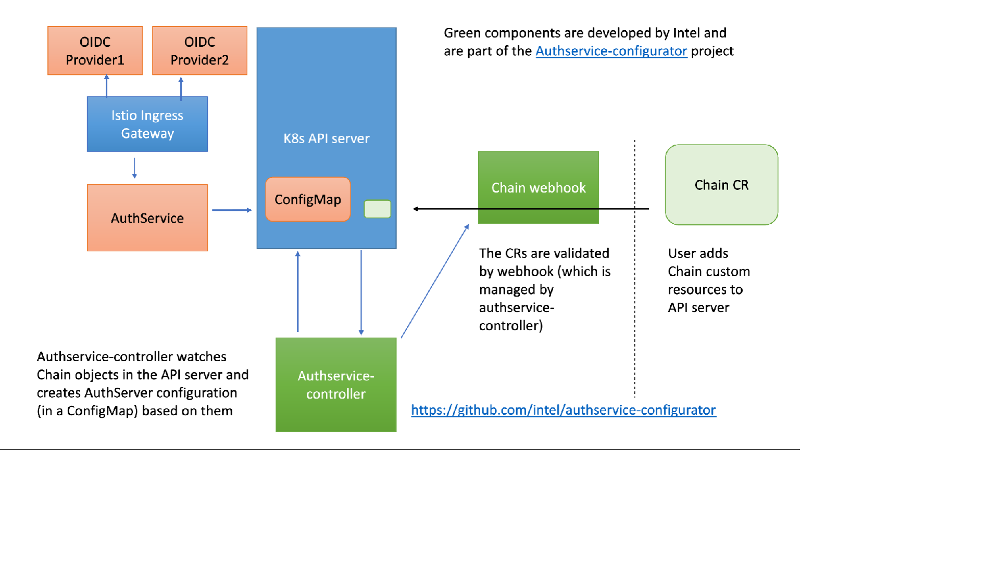

# Configurator for AuthService*

Configurator for AuthService* manages AuthService configuration. It
creates and controls Chain CRD. The users create CRs, and the controller
uses them to build AuthService configuration files and wraps them into
ConfigMaps.  The main use case to enable multi-tenant configuration of
AuthService running with Istio Ingress Gateway deployment.



# Install Configurator for AuthService*

[Install cert-manager to the cluster](https://cert-manager.io/docs/installation/kubernetes/),
and install [kubebuilder](https://book.kubebuilder.io/quick-start.html#installation) and
[kustomize](https://kubernetes-sigs.github.io/kustomize/installation/) locally. Then run the
following commands. Replace `<registry>` and `<tag>` with suitable values for the Docker
registry you use.

```bash
make docker-build
docker tag controller <registry>/<tag>
docker push <registry>/<tag>
kubectl create namespace authservice-webhook
make deploy IMG=<registry>/<tag>
```

# Deploy Authservice

Install AuthService Service and Deployment objects. Note that AuthService
can't start yet because the ConfigMap is missing. If you want to integrate
with Istio Ingress Gateway, you should deploy this to istio-system namespace.

```yaml
apiVersion: v1
kind: Service
metadata:
  name: authservice
  labels:
    app: authservice
spec:
type: ClusterIP
ports:
- port: 10003
  protocol: TCP
selector:
  app: authservice
---
apiVersion: apps/v1
kind: Deployment
metadata:
name: authservice
labels:
  app: authservice
spec:
replicas: 1
selector:
  matchLabels:
  app: authservice
template:
  metadata:
    labels:
      app: authservice
  spec:
    containers:
    - name: authservice
      image: adrianlzt/authservice:0.3.1-d3cd2d498169
      imagePullPolicy: Always
      ports:
      - containerPort: 10003
      volumeMounts:
      - name: authservice-configmap-volume
        mountPath: /etc/authservice
    volumes:
    - name: authservice-configmap-volume
      configMap:
        name: authservice-configmap
```

Install at least one Chain. Make sure to change the Chain values to
correspond to your own OIDC installation. Install the Chains to the
namespace where you have your AuthService instance running. After this
the ConfigMap which the AuthService needs is dynamically created and
AuthService deployment in the same namespace is restarted. The
AuthService deployment to be restarted is given to the controller as
command line parameter `authservice-deployment`.

```yaml
apiVersion: authcontroller.intel.com/v1
kind: Chain
metadata:
  name: chain-sample-1
spec:
  authorizationUri: "https://example.com/auth/realms/service-name/protocol/openid-connect/auth"
  tokenUri: "https://example.com/auth/realms/service-name/protocol/openid-connect/token"
  callbackUri: "https://example.com/service/oauth/callback"
  clientId: "service-name-client"
  clientSecret: "secret"
  trustedCertificateAuthority: |-
    -----BEGIN CERTIFICATE-----
    MIID/jCCAuagAwIBAgIJAIBn8rG1PDPGMA0GCSqGSIb3DQEBCwUAMC0xFTATBgNV
    BAoMDGV4YW1wbGUgSW5jLjEUMBIGA1UEAwwLZXhhbXBsZS5jb20wHhcNMjAwODI4
    MDcyNDMzWhcNMjEwODI4MDcyNDMzWjAzMR4wHAYDVQQDDBV3b2xmcGFzcy5maS5p
    bnRlbC5jb20xETAPBgNVBAoMCGtleWNsb2FrMIIBIjANBgkqhkiG9w0BAQEFAAOC
    AQ8AMIIBCgKCAQEA7RN1yIpvdkXFtj98BFk0wfk1SyDGcmavkKkv++U94IFyQSdq
    hQyzywiky2xd+0oxS90nzs9L3hyhBCNHZrEf15LCZAJp3ea6WZytyEUoJV3swGP0
    g5DbCA/qe4El/XDsmHcZT3aQOcxMMANGA2aMDlddMenfjjQ17iKPa5qbNKt83qro
    aZTP9gJK/TjZ18zP9K9hml4xORY1kI5pIYhfwhaNo5R6UigbueWElqC4jvAPPilb
    R5IT2w2A56XnVZ2OUXoSg0qzGb2wmNQUBZO32e6c9vmAObNZrMi0I89lMyQffaM4
    SEnzdcxBr9jJbTYQDIbHePhzZ0CGtYR79fKsFwIDAQABo4IBGTCCARUwCQYDVR0T
    BAIwADARBglghkgBhvhCAQEEBAMCBkAwKgYJYIZIAYb4QgENBB0WG0tleWNsb2Fr
    IFNlcnZlciBDZXJ0aWZpY2F0ZTAdBgNVHQ4EFgQUg571b/q/W7U4+TWvQMvnZV9k
    /XkwXQYDVR0jBFYwVIAUcM9zQaUhEi07KEULbAxO/JnAiImhMaQvMC0xFTATBgNV
    BAoMDGV4YW1wbGUgSW5jLjEUMBIGA1UEAwwLZXhhbXBsZS5jb22CCQDXgFUtkk1h
    izAOBgNVHQ8BAf8EBAMCBaAwEwYDVR0lBAwwCgYIKwYBBQUHAwEwJgYDVR0RBB8w
    HYcECu1HYYIVd29sZnBhc3MuZmkuaW50ZWwuY29tMA0GCSqGSIb3DQEBCwUAA4IB
    AQBt0wj7nCrbN5/taEYRQAWlcNQNGglGGUMy7soYKaZe87IJB/dnO9QZpwRluNdU
    Aa4kiggI5aXa51iUplxqh8/QSH9zS/AhQgCwq8z67BNm6GySPMhf5ulpeoh5KNWP
    wmYusDmhcQ9R39ASkpTUJvjhzf2bOFprFEAQ41tcjgWygWWKpo58Rn2JzADh7XaL
    jk+yfpOEQN00uTSATZaMycuuVy5eQix9jlYi6ofL05UqyyR1dyRdKxR9QkjCgWBR
    PhlYSAIkgK1/yoEX+UEEFJIdFwkYdvUWe4kGBOA/5cSxl/E52OpIJYXHTEikO2Gy
    aNe/8WiLyjUgB0t4hFNJLW8o
    -----END CERTIFICATE-----
  cookieNamePrefix: "service-name"
  jwks: '{
      "keys": [
        {
          "kid": "Lnb9hEc1XCJVle2NvHOuicPWx3oLRq4bAhK7abmRnO4",
          "kty": "RSA",
          "alg": "RS256",
          "use": "sig",
          "n": "8fyaXJkzsKlmKNr_TLqMgfdq-X-Jj94KU6XFUNnn1Cd7moDgBR5Q_4r7d0T9apjtnwj0Fp8-PwIR73iMwuBCrmQfWTqW2yLSr-z66FZ--_PUPzMi3wsRx7MzPpveqbxFIUlsJzF3MlwWwMCoZnUrktBjIrf0cuyJUb2OXc3jUTd7fgty_MJhHtBYXqjRF1JJbNVjCp1Z_8jAdNkOR-7R-1hnEeTF3xnUY2JGu4FZYeauJuJOW9AhBgWkymccv8EOkAWSXOmT30bqctBme7zvjHg2bvTr-8HQxsFH57e0hIyzoxd6ynx8MV6a6dqh8q5Qk_YkSgsRjXY0JW4sXsUqJQ",
          "e": "AQAB",
          "x5c": [
            "MIICmzCCAYMCBgF3lgNN+zANBgkqhkiG9w0BAQsFADARMQ8wDQYDVQQDDAZtYXN0ZXIwHhcNMjEwMjEyMTEzMDM0WhcNMzEwMjEyMTEzMjE0WjARMQ8wDQYDVQQDDAZtYXN0ZXIwggEiMA0GCSqGSIb3DQEBAQUAA4IBDwAwggEKAoIBAQDx/JpcmTOwqWYo2v9MuoyB92r5f4mP3gpTpcVQ2efUJ3uagOAFHlD/ivt3RP1qmO2fCPQWnz4/AhHveIzC4EKuZB9ZOpbbItKv7ProVn7789Q/MyLfCxHHszM+m96pvEUhSWwnMXcyXBbAwKhmdSuS0GMit/Ry7IlRvY5dzeNRN3t+C3L8wmEe0FheqNEXUkls1WMKnVn/yMB02Q5H7tH7WGcR5MXfGdRjYka7gVlh5q4m4k5b0CEGBaTKZxy/wQ6QBZJc6ZPfRupy0GZ7vO+MeDZu9Ov7wdDGwUfnt7SEjLOjF3rKfHwxXprp2qHyrlCT9iRKCxGNdjQlbixexSolAgMBAAEwDQYJKoZIhvcNAQELBQADggEBALNqrtfcMuVnOci/DftEwHWwKxSMc8RGNRQRylK4uRVvWWbF91WO2KKcR9rozpDImOmAJy6WFRrEYDvP4Q5UwKBdddFiQfRmO2RJmVtiEhSo+odg38yBTOXfD4Q1uTTahAreoZew03WfqK0ZtVL2/m3RFddQci1qsdVsLlPAyql+Whq8JAn5T9UxjmpJX6xXT07pgPMMnNKxyw5ZElc3N6hMJ4hoPfwnXFCwJsarTQ9KMh/oTERkymWmBiz60dlVlSAWUzUBrWHzdcaiI45GPu4r6kGrUJNMnMrLSnol/oyEN7TAm7TOO0qWnoES+Yjy/3YgL6Y1n4qA0IjHyghCH8g="
          ],
          "x5t": "1gwZjIyxr11xV-IlcEhU5DiggQM",
          "x5t#S256": "tL1nVUi6CPYQ_nRngy2Q0T4avhHi25Hqor8xNg4eMqs"
        }
      ]
    }'
match:
  header: ":path"
  prefix: "/service"
````

If used with Ingress Gateway controller, make sure Ingress Gateway proxy
is configured to use AuthService. It's important that the AuthService
pod isn't part of the service mesh or otherwise Istio
AuthorizationPolicy is configured to ignore it, so that the connection
there works without a JWT.

```yaml
apiVersion: networking.istio.io/v1alpha3
kind: EnvoyFilter
metadata:
  name: external-authz-filter-for-ingress
  namespace: istio-system
spec:
  workloadSelector:
    labels:
      istio: ingressgateway
      app: istio-ingressgateway
  configPatches:
  - applyTo: HTTP_FILTER
    match:
      context: GATEWAY
      listener:
        filterChain:
          filter:
            name: "envoy.http_connection_manager"
            subFilter:
              name: "envoy.filters.http.jwt_authn"
    patch:
      operation: INSERT_BEFORE
      value:
        name: envoy.ext_authz
        typed_config:
          "@type": type.googleapis.com/envoy.extensions.filters.http.ext_authz.v3.ExtAuthz
          stat_prefix: ext_authz
          grpc_service:
            envoy_grpc:
              cluster_name: ext_authz
            timeout: 10s # Timeout for the entire request (including authcode for token exchange with the IDP)
  - applyTo: CLUSTER
    match:
      context: ANY
      cluster: {} # this line is required starting in istio 1.4.0
    patch:
      operation: ADD
      value:
        name: ext_authz
        connect_timeout: 5s # This timeout controls the initial TCP handshake timeout - not the timeout for the entire request
        type: LOGICAL_DNS
        lb_policy: ROUND_ROBIN
        http2_protocol_options: {}
        load_assignment:
          cluster_name: ext_authz
          endpoints:
          - lb_endpoints:
            - endpoint:
                address:
                  socket_address:
                    address: authservice
                    port_value: 10003
```

## AuthService over TLS connection

If you want to use AuthService over a TLS connection, use this EnvoyFilter:

```yaml
apiVersion: networking.istio.io/v1alpha3
kind: EnvoyFilter
metadata:
  name: external-authz-filter-for-ingress
  namespace: istio-system
spec:
  workloadSelector:
    labels:
      istio: ingressgateway
      app: istio-ingressgateway
  configPatches:
  - applyTo: HTTP_FILTER
    match:
      context: GATEWAY
      listener:
        filterChain:
          filter:
            name: "envoy.http_connection_manager"
            subFilter:
              name: "envoy.filters.http.jwt_authn"
    patch:
      operation: INSERT_BEFORE
      value:
        name: envoy.ext_authz
        typed_config:
          "@type": type.googleapis.com/envoy.extensions.filters.http.ext_authz.v3.ExtAuthz
          stat_prefix: ext_authz
          grpc_service:
            envoy_grpc:
              cluster_name: ext_authz
            timeout: 10s # Timeout for the entire request (including authcode for token exchange with the IDP)
  - applyTo: CLUSTER
    match:
      context: ANY
      cluster: {} # this line is required starting in istio 1.4.0
    patch:
      operation: ADD
      value:
        name: ext_authz
        connect_timeout: 5s # This timeout controls the initial TCP handshake timeout - not the timeout for the entire request
        type: LOGICAL_DNS
        lb_policy: ROUND_ROBIN
        http2_protocol_options: {}
        load_assignment:
          cluster_name: ext_authz
          endpoints:
          - lb_endpoints:
            - endpoint:
                address:
                  socket_address:
                    address: authservice.istio-system
                    port_value: 443
        transport_socket:
          name: envoy.transport_sockets.tls
          typed_config:
            "@type": type.googleapis.com/envoy.extensions.transport_sockets.tls.v3.UpstreamTlsContext
          sni: authservice.istio-system
          common_tls_context:
            validation_context:
              match_subject_alt_names:
              - exact: "authservice.istio-system"
              trusted_ca:
                inline_string: "-----BEGIN CERTIFICATE-----\nMIIErjCCApYCCQDeffa6ViLglzANBgkqhkiG9w0BAQsFADAZMRcwFQYDVQQDDA5j\nYTAwMC5ob21lLmxhbjAeFw0yMDExMDIxNjAxNDFaFw0yMzA4MjMxNjAxNDFaMBkx\nFzAVBgNVBAMMDmNhMDAwLmhvbWUubGFuMIICIjANBgkqhkiG9w0BAQEFAAOCAg8A\nMIICCgKCAgEA3KBZTTx0tHvJBnJCVvjvfSpl+OgWIYO80NsSq/6Vu2QUJezZwtG8\no1m+JKN4O6WPsyRtcx1aV/4pPTgKKvF07IWFUG11O5Iu88pO5xJ5ssQjJNIuHXwG\nqxbYxk0fnNUl9mbJchGYxVIH2bJEULe167wnVYsQ2W3xYxzkH0kBJ/iClqf+z0aH\nzk9l0klS+4TOm2P+a5opi/suUEYKc+oC+KoXzBBa1j9tOpfoGGFCcHk8Ho1X6YE5\n4YeaCL0EkM7wIrlnJQuepjWbR01L7dVHePTFNxlUtipUkbjeuxPBDylT5DbRrXos\nDS1EmEJtbDpDs4BE51e0Q+bKOo2a19468iCyAirrSQWbsvat2Mu1LOowqMEF1zpH\n8BEmMTT8YPbKYB8+8UlUgySQs6jH5DOYFyK4Q2A8HHWjp937LcTm7wiEqbLgSvqL\nfS1+uw0PrUHSbu1vOJcZepFFw2UmTmwuWDiPWkKSLCFgyol1eJBFSV2uzVnKtO76\nWV9LH7H9tHM3wCnLuYs0Lmz9aiDZMzwTxhDZyoJt4vLPqAaWi0y+bHNyo8bBK75m\nbGBQZ4yWGTltu0ZWUGAa9eJ+dfqu6jFpEvGIcm0rVu0Czl2NPn3r4NyRnJWbiGKm\nf2IjGUbNTW+IimvJ7PZpZShac8qlrGpOs2aiz4HLvWSDye9zIuOCC2kCAwEAATAN\nBgkqhkiG9w0BAQsFAAOCAgEAPqsor531mVs5ofQjl2PaJxxA5xYenKrENP2YZUus\nBNsnXlxlk+XaDkMDrRaUqn9C7ZpVOyoEPG7sfmEEQDb+Cmxxlpbu8WZza3FODdSW\nCDyEDAOcggLX6AmJHs4rs7ebAN8UnPJ+8ULg/FBmHLgbu+sRpGv9Ws+f+5hwPwk2\nXfgLi6w02CVrvm9zG2JYCartlv0uQmMwwZoNu8i9JFWRPS07fnbEAnOOGTLV4JUC\nhZoV/pUi3oEe488NGMIv9pVVoCns8Jy/tHYFsvR6e+IaW7GzckElKCi0MwvWCDad\n9pBexGMBCLapaWtS2lCwgNC0stTFV/fVswUHVxY3S1Q3bI8joaWn0rhdjaLli5Gg\ncH9STlpIqlIZrob2DDvxE3PMrBRQunRfMCWFsz4It5XZfYSycJgkveIOGmouG0Bh\nmwOCIfPSjMg0ZLE0MIM8zv0A86PyQbavCOuuiD8G/2fHK604W4iMDhXtED4hKe9D\npj/4akfGbxDmN/mFfG0f+0yu55YbTLmar5R1YWnjaQwo8rKDmAyrD95Q2Wt6kYec\nRZVWmdZ32ASWQF4s1ORLsKJMZkDQEauR9qsX9TODQK25MbiVi6I/tEjVD5YvwoKW\neB5SMtlsd5aM1OFB+9PmZj52RXPvhvUJKx/0OmYrkPqlbKXzMhauBYsM4A7SUO0X\np0A=\n-----END CERTIFICATE-----"
```

You'll need to deploy AuthService together with an Envoy sidecar which
will handle the TLS termination.

```yaml
apiVersion: v1
kind: Service
metadata:
  name: authservice
  namespace: istio-system
  labels:
    app: authservice-behind-envoy
spec:
  type: ClusterIP
  ports:
    - port: 443
      targetPort: 30001
      protocol: TCP
      name: https
  selector:
    app: authservice-behind-envoy
---
apiVersion: v1
kind: ConfigMap
metadata:
  name: envoy-config
  namespace: istio-system
data:
  envoy-conf.yaml: |
    static_resources:
      listeners:
      - name: listener_0
        address:
          socket_address: { address: 0.0.0.0, port_value: 30001 }
        filter_chains:
        - filters:
          - name: envoy.filters.network.http_connection_manager
            typed_config:
              "@type": type.googleapis.com/envoy.extensions.filters.network.http_connection_manager.v3.HttpConnectionManager
              access_log:
              - name: envoy.access_loggers.file
                typed_config:
                  "@type": type.googleapis.com/envoy.extensions.access_loggers.file.v3.FileAccessLog
                  path: /dev/stdout
              codec_type: AUTO
              stat_prefix: ingress_http
              route_config:
                name: local_route
                virtual_hosts:
                - name: backend
                  domains: ["*"]
                  routes:
                  - match: { prefix: "/" }
                    route: { cluster: local_service }
              http_filters:
              - name: envoy.filters.http.router
          transport_socket:
            name: envoy.transport_sockets.tls
            typed_config:
              "@type": type.googleapis.com/envoy.extensions.transport_sockets.tls.v3.DownstreamTlsContext
              common_tls_context:
                tls_certificates:
                  - certificate_chain: { filename: "/etc/envoy/tls/tls.crt" }
                    private_key: { filename: "/etc/envoy/tls/tls.key" }
                validation_context:
                  trusted_ca:
                    inline_string: "-----BEGIN CERTIFICATE-----\nMIIErjCCApYCCQDeffa6ViLglzANBgkqhkiG9w0BAQsFADAZMRcwFQYDVQQDDA5j\nYTAwMC5ob21lLmxhbjAeFw0yMDExMDIxNjAxNDFaFw0yMzA4MjMxNjAxNDFaMBkx\nFzAVBgNVBAMMDmNhMDAwLmhvbWUubGFuMIICIjANBgkqhkiG9w0BAQEFAAOCAg8A\nMIICCgKCAgEA3KBZTTx0tHvJBnJCVvjvfSpl+OgWIYO80NsSq/6Vu2QUJezZwtG8\no1m+JKN4O6WPsyRtcx1aV/4pPTgKKvF07IWFUG11O5Iu88pO5xJ5ssQjJNIuHXwG\nqxbYxk0fnNUl9mbJchGYxVIH2bJEULe167wnVYsQ2W3xYxzkH0kBJ/iClqf+z0aH\nzk9l0klS+4TOm2P+a5opi/suUEYKc+oC+KoXzBBa1j9tOpfoGGFCcHk8Ho1X6YE5\n4YeaCL0EkM7wIrlnJQuepjWbR01L7dVHePTFNxlUtipUkbjeuxPBDylT5DbRrXos\nDS1EmEJtbDpDs4BE51e0Q+bKOo2a19468iCyAirrSQWbsvat2Mu1LOowqMEF1zpH\n8BEmMTT8YPbKYB8+8UlUgySQs6jH5DOYFyK4Q2A8HHWjp937LcTm7wiEqbLgSvqL\nfS1+uw0PrUHSbu1vOJcZepFFw2UmTmwuWDiPWkKSLCFgyol1eJBFSV2uzVnKtO76\nWV9LH7H9tHM3wCnLuYs0Lmz9aiDZMzwTxhDZyoJt4vLPqAaWi0y+bHNyo8bBK75m\nbGBQZ4yWGTltu0ZWUGAa9eJ+dfqu6jFpEvGIcm0rVu0Czl2NPn3r4NyRnJWbiGKm\nf2IjGUbNTW+IimvJ7PZpZShac8qlrGpOs2aiz4HLvWSDye9zIuOCC2kCAwEAATAN\nBgkqhkiG9w0BAQsFAAOCAgEAPqsor531mVs5ofQjl2PaJxxA5xYenKrENP2YZUus\nBNsnXlxlk+XaDkMDrRaUqn9C7ZpVOyoEPG7sfmEEQDb+Cmxxlpbu8WZza3FODdSW\nCDyEDAOcggLX6AmJHs4rs7ebAN8UnPJ+8ULg/FBmHLgbu+sRpGv9Ws+f+5hwPwk2\nXfgLi6w02CVrvm9zG2JYCartlv0uQmMwwZoNu8i9JFWRPS07fnbEAnOOGTLV4JUC\nhZoV/pUi3oEe488NGMIv9pVVoCns8Jy/tHYFsvR6e+IaW7GzckElKCi0MwvWCDad\n9pBexGMBCLapaWtS2lCwgNC0stTFV/fVswUHVxY3S1Q3bI8joaWn0rhdjaLli5Gg\ncH9STlpIqlIZrob2DDvxE3PMrBRQunRfMCWFsz4It5XZfYSycJgkveIOGmouG0Bh\nmwOCIfPSjMg0ZLE0MIM8zv0A86PyQbavCOuuiD8G/2fHK604W4iMDhXtED4hKe9D\npj/4akfGbxDmN/mFfG0f+0yu55YbTLmar5R1YWnjaQwo8rKDmAyrD95Q2Wt6kYec\nRZVWmdZ32ASWQF4s1ORLsKJMZkDQEauR9qsX9TODQK25MbiVi6I/tEjVD5YvwoKW\neB5SMtlsd5aM1OFB+9PmZj52RXPvhvUJKx/0OmYrkPqlbKXzMhauBYsM4A7SUO0X\np0A=\n-----END CERTIFICATE-----"
      clusters:
      - name: local_service
        connect_timeout: 3.25s
        type: LOGICAL_DNS
        lb_policy: ROUND_ROBIN
        http2_protocol_options: {}
        load_assignment:
          cluster_name: some_service
          endpoints:
          - lb_endpoints:
            - endpoint:
                address:
                  socket_address:
                    address: 127.0.0.1
                    port_value: 10003
    admin:
      access_log_path: "/dev/null"
      address:
        socket_address:
          address: 0.0.0.0
          port_value: 9001
---
apiVersion: apps/v1
kind: Deployment
metadata:
  name: authservice-behind-envoy
  namespace: istio-system
  labels:
    app: authservice-behind-envoy
spec:
  replicas: 1
  selector:
      matchLabels:
        app: authservice-behind-envoy
  template:
    metadata:
      labels:
        app: authservice-behind-envoy
    spec:
      containers:
      - name: envoy
        image: envoyproxy/envoy:v1.16-latest
        imagePullPolicy: IfNotPresent
        securityContext:
          capabilities:
            add: ["IPC_LOCK"]
        args:
          - "-c"
          - "/etc/envoy/config/envoy-conf.yaml"
          - "--cpuset-threads"
        ports:
          - containerPort: 30001
        volumeMounts:
          - name: tls
            mountPath: /etc/envoy/tls
            readOnly: true
          - name: config
            mountPath: /etc/envoy/config
            readOnly: true
          - name: resetdir
            mountPath: /etc/ssl
      - name: authservice
        image: adrianlzt/authservice:0.3.1-d3cd2d498169
        imagePullPolicy: Always
        ports:
          - containerPort: 10003
        volumeMounts:
          - name: authservice-configmap-volume
            mountPath: /etc/authservice
      volumes:
      - name: authservice-configmap-volume
        configMap:
          name: authservice-configmap
      - name: resetdir
        emptyDir: {}
      - name: tls
        secret:
          secretName: authservice-certs
      - name: config
        configMap:
          name: envoy-config
```

In addition you'll need to create secret `authservice-certs` which has
files `/etc/envoy/tls/tls.crt` and `/etc/envoy/tls/tls.key`, and the cert
needs to be signed by the CA referenced in the `trusted_ca` field above. The
SNI has to be `authservice.istio-system`.

# Known issues and missing features
  * Gathering Chains from several namespaces for a single AuthService
    deployment.
